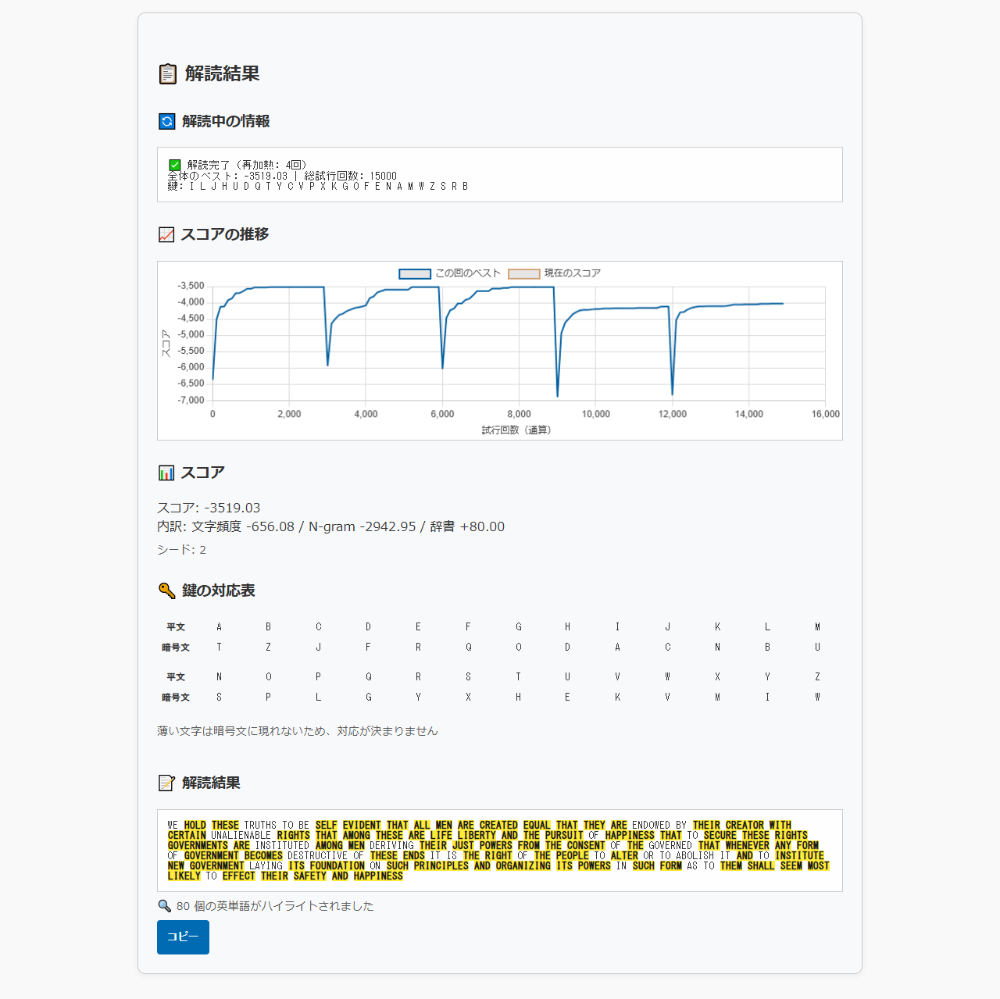
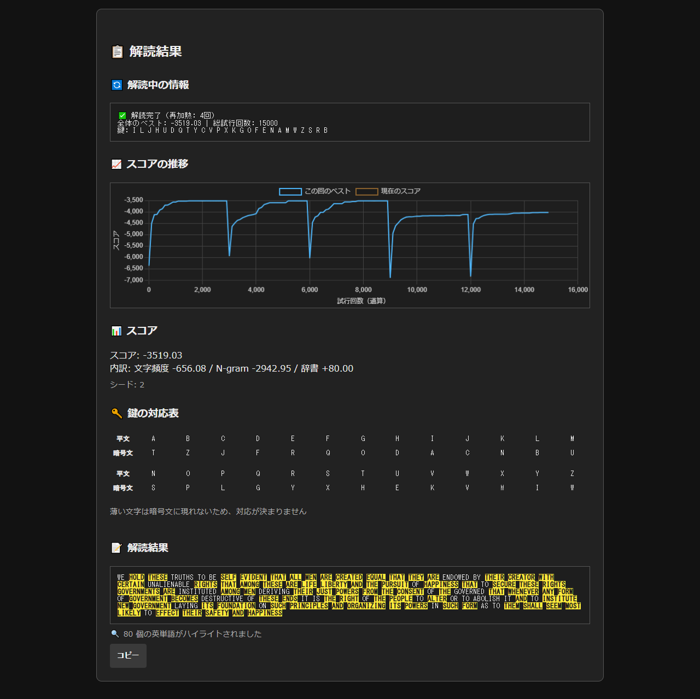
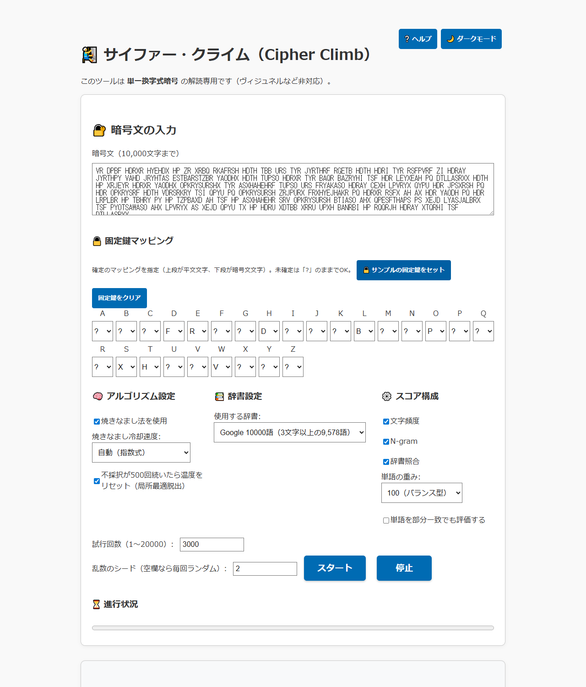

# Cipher Climb - A Hill Climbing Solver for Monoalphabetic Substitution Ciphers

English · [日本語](README.md)

[](https://github.com/ipusiron/cipherclimb/stargazers)
[](https://github.com/ipusiron/cipherclimb/network/members)
[](https://github.com/ipusiron/cipherclimb/commits/main)
[](LICENSE)
[](https://ipusiron.github.io/cipherclimb/)

**Day018 - 100 Security Tools with Generative AI**

Cipher Climb is a web app that breaks monoalphabetic substitution ciphers, one of the classic
cipher families, with hill climbing.

The name joins "cipher" and "climb": the search climbs toward a better key and loosens the cipher
step by step.

The tool is meant for teaching. It shows, and lets you play with, the way a score-driven search
recovers the key on its own.

---
## 🌐 Live demo

👉 [https://ipusiron.github.io/cipherclimb/](https://ipusiron.github.io/cipherclimb/)

---
## 📸 Screenshots

The screenshots below come from the running tool. The interface is in Japanese there; switch it
with the button in the top right corner.


> *Result for seed 2 with no fixed key: the score breakdown, both history lines, the key and 80 highlighted words*


> *The same result on the dark theme, keeping the yellow highlight readable*


> *The input card with the 8 sample fixed mappings and seed 2, before the run*

---

## ✨ Features

- A reproducible search driven by a seed, and the best key so far when you stop it early
- Letter frequency, n-gram and word list scoring, each switchable, with the current and best score plotted
- Fixed key mappings with conflict detection, a choice of word lists, and exact word matches highlighted
- Light and dark themes, a mobile layout, and a help dialog you can drive from the keyboard
- Japanese and English interface (`?lang=en` in the URL, the browser language, or your saved choice)

## 📖 How to use it

1. Leave the default ciphertext and settings, type `2` in the seed field and press Start
2. Read the score, the key table and the decrypted text. Yellow words matched the selected word list exactly
3. Change the seed, or turn simulated annealing off, and compare. A blank seed draws a new seed each run
4. Pin the mappings you already know as a fixed key. "Load the sample fixed key" belongs to the default ciphertext
5. Stop shows the best key found so far, and Copy takes the plaintext out

"Clear the fixed key" returns all 26 letters to unset. Settings are read once at the start, and the
run keeps them until it finishes.

## 🔧 Specification

| Item | Detail |
|------|--------|
| Cipher | Monoalphabetic substitution cipher |
| Search | Hill climbing / simulated annealing |
| Input | Letters A to Z (lowercase counts as uppercase). Spaces, newlines, punctuation, digits and non-ASCII characters are kept. Up to 10,000 characters |
| Output | Key table, decrypted text, score, highlighted words |
| Fixed key | Any "plain to cipher" mapping can be pinned (conflicts are flagged) |
| Score | Letter frequency, n-gram and word list scores add up, each on or off |
| Score history | Every 100 tries it plots the best of this restart and the current score |
| Word lists | Google 10000 (9,578 words of 3+ letters) or the basic 343 words (320 of them are matched) |
| Tries | 1 to 20000, 3000 by default (per restart) |
| Restarts | 5. Each starts from another random key, and the overall best wins |
| Temperature | Starts at 10 and ends at 0.01 when cooling is automatic. Reheats after 500 rejections |
| Seed | An integer from 0 to 4294967295. A blank field draws one per run |
| Short input | Under 100 letters it warns. The answer may not be unique |

---

### About the fixed key

- A key is a permutation of the 26 letters of the alphabet
- A fixed mapping goes from plaintext to ciphertext. Claiming one ciphertext letter twice is invalid and turns red
- With 25 or more letters pinned the rest follows, so the tool skips the search and shows the result
- Letters that never appear in the ciphertext cannot be decided, so the key table fades them

### Worked examples

These use the default sample (639 characters, 529 letters, 111 words). Accuracy is the share of
letter positions that match the true plaintext.

| Setting | Seed | Score | Accuracy |
|---|---|---|---|
| Default | 1 | -3520.88 | 99.81% |
| Default | 2 | -3519.03 | 100.00% |
| Hill climbing (annealing off) | 1 | -3519.03 | 100.00% |
| Word list off | 1 | -3599.03 | 100.00% |
| 200 tries | 1 | -4268.13 | 42.53% |
| Letter frequency only, 500 tries | 1 | -653.54 | 33.65% |
| Sample fixed key, 300 tries | 1 | -3546.53 | 96.79% |

With seed 1 and the defaults, `ORGANIZING` comes out as `ORGANIXING`. The true plaintext has one Z
and no X, so the two are easy to swap for a very small score difference.
M never appears in the ciphertext. The ciphertext itself is loaded into the input field from
`samples.js` at start-up.

### Success rate

Each row runs seeds 1 to 10. The short ciphertext is the first 32 words of the plaintext (ending
`ARE LIFE LIBERTY AND`) encrypted with the same key.

| Ciphertext | Method | Fully solved | Mean accuracy |
|---|---|---|---|
| Default ciphertext (529 letters) | Simulated annealing (default) | 8/10 | 93.9% |
| Default ciphertext (529 letters) | Hill climbing | 10/10 | 100.0% |
| Short ciphertext (148 letters) | Simulated annealing (default) | 4/10 | 78.2% |
| Short ciphertext (148 letters) | Hill climbing | 3/10 | 72.2% |

Both methods solve the long ciphertext. On the short one annealing wins slightly more often, but
ten runs are not enough to call either method better in general.
More tries may help, and still guarantee nothing.

---

## 📘 How the algorithms work

### 🔼 Hill climbing

One of the simplest search algorithms. It scores a candidate key and keeps any neighbour that
scores better.

- Upside: simple and fast
- Downside: it settles into a local optimum, satisfied halfway up the hill

### 🔥 Simulated annealing

Hill climbing with randomness controlled by a "temperature".

- A worse key is sometimes accepted, so the search keeps moving
- The temperature, and with it the acceptance probability, falls over time
- The cooling rate decides how stubborn the search stays
- This tool can also reheat to 10 after 500 rejections in a row

## 🔬 How the score works

Letter frequency and n-grams use log likelihood; the word list adds a bonus. Internally the tool
keeps integers of `round(log10(probability) × 100)` and divides by 100 for display.
Letter frequency covers single letters, and n-grams add the values of 2-letter and 3-letter
sequences. For a fixed length, a larger value (closer to 0) reads as more English-like.
A sequence the corpus never saw is worth -8.71 on screen.

The word list adds "weight / 100" for every matching word of 3 or more letters. At the default
weight of 100 that is +1.00 per word.
Prefix matching also credits prefixes of 3 or more letters. Highlighting always uses exact matches
only, so the highlight count can differ from the number of scored words.

The statistics come from 10 works on Project Gutenberg, 5,141,270 letters in all. They contain 623
observed bigrams and 8,604 observed trigrams.
The plaintext of the default ciphertext, the United States Declaration of Independence, is not part
of the corpus.

| Work | Author |
|---|---|
| Alice's Adventures in Wonderland | Lewis Carroll |
| Adventures of Huckleberry Finn | Mark Twain |
| Frankenstein | Mary Wollstonecraft Shelley |
| A Tale of Two Cities | Charles Dickens |
| The Picture of Dorian Gray | Oscar Wilde |
| Dracula | Bram Stoker |
| Pride and Prejudice | Jane Austen |
| Great Expectations | Charles Dickens |
| The Adventures of Sherlock Holmes | Arthur Conan Doyle |
| Moby Dick; Or, The Whale | Herman Melville |

With the same source texts in a folder, a developer can rebuild the model with the command below.
Gutenberg texts are revised from time to time, so the values may not come out identical.
Neither the generator nor the source texts are loaded when the tool runs.

```sh
node tools/build-ngram-model.mjs <folder with the texts>
```

### Where the word list comes from

The 9,578-word list is [google-10000-english](https://github.com/first20hours/google-10000-english)
narrowed to words of 3 or more letters.
[The upstream terms](https://github.com/first20hours/google-10000-english/blob/master/LICENSE.md)
allow educational, personal and research use; commercial use needs a license from the Linguistic
Data Consortium.
The MIT license of this repository does not extend to that word list.

---

## 🎓 What it teaches

- The structure of a classic substitution cipher, seen rather than described
- The difference between annealing and plain hill climbing, and where each one helps
- What a score is made of (letter frequency, word matches) and how tuning it changes the search

---

## 🔗 Related links

- [*Practical Guide to Cryptanalysis* (Japanese)](https://akademeia.info/?page_id=39995)
    - Chapter 16: Breaking ciphers with hill climbing, pp. 367-401

## 🔒 Security and privacy

Everything runs inside the browser, and the tool makes no network request while it works.
Chart.js 4.5.1 ships in `vendor/` under its MIT license.
The badges in this README render on GitHub only; the tool itself loads no external image and no CDN.
Input is never treated as HTML: it is shown through DOM APIs. The only things saved in localStorage
are the theme and the interface language.
The search uses a reproducible seeded pseudo-random generator. It is not a cryptographic one.

The CSP is as follows. `frame-ancestors` has no effect in a meta tag, so it is left out. Set it as
an HTTP header if your deployment needs to restrict framing.

```text
default-src 'self'; script-src 'self'; style-src 'self'; img-src 'self' data:; font-src 'self'; connect-src 'none'; object-src 'none'; base-uri 'self'; form-action 'self'
```

## ⚠️ Caveats

- Teaching material for cryptanalysis. It targets classic ciphers and cannot touch modern ones
- A statistical guess that assumes English. The highest score is not always the right plaintext
- Accuracy drops on short ciphertexts and on text without word breaks
- A conflicting fixed key, input without letters, and input over the limit all stop the run with an error

## 🧪 Tests

Node 22 or newer, with no packages to install.

```sh
npm test
```

GitHub Actions runs them on every push and pull request. They recheck the model hash, the known
answers A to P, an early stop, the dictionary key sets, and the worked-example and success-rate
tables in both READMEs.

## 📁 Directory structure

```text
cipherclimb/                                     # Solver for monoalphabetic substitution ciphers
├── .github/                                     # GitHub configuration
│   └── workflows/                               # GitHub Actions workflows
│       └── test.yml                             # Runs npm test on push and pull request
├── .gitignore                                   # Paths kept out of Git
├── .nojekyll                                    # Turns off Jekyll on Pages
├── assets/                                      # Screenshots for the README
│   ├── screenshot.png                           # Older screen (not linked from the README)
│   ├── screenshot2.png                          # Result on the light theme
│   ├── screenshot3.png                          # The same result on the dark theme
│   └── screenshot4.png                          # Input card with the sample fixed key
├── chart.js                                     # Score history drawn with Chart.js
├── CLAUDE.md                                    # Development guide for AI assistants
├── dictionaries.js                              # Word lists and their display names
├── englishWords_basic343.js                     # The basic 343-word list
├── englishWords_google10000.js                  # The 9,578-word frequency list
├── favicon.ico                                  # Site icon
├── i18n.js                                      # Japanese and English text, and the switch
├── index.html                                   # Markup of the page
├── LICENSE                                      # MIT license of this tool
├── main.js                                      # Page assembly and event handling
├── ngramModel.js                                # English letter n-gram statistics (generated)
├── package.json                                 # npm test definition, no dependencies
├── README.en.md                                 # This document
├── README.md                                    # Japanese documentation
├── samples.js                                   # Sample plaintext, key and ciphertext
├── score.js                                     # Integer score computation
├── solver.js                                    # The search and the seeded generator
├── style.css                                    # CSS variables and the responsive layout
├── test/                                        # Automated tests for node --test
│   ├── contrast.test.js                         # 23 text and 5 non-text contrast pairs
│   ├── format.test.js                           # Line length and readability
│   ├── html.test.js                             # CSP, ARIA and the input contract
│   ├── i18n.test.js                             # Dictionary keys and leftover Japanese
│   ├── model.test.js                            # Model and vendor counts and hashes
│   ├── readme.test.js                           # Examples, success rates, images, the tree
│   ├── samples.test.js                          # Samples and how the defaults are set
│   ├── score.test.js                            # Integer scores and word matching
│   ├── solver.test.js                           # Answers A to P and the early stop
│   ├── static.test.js                           # Purity, safe rendering, CI settings
│   ├── support.js                               # Shared test setup and accuracy
│   └── utils.test.js                            # Letters, input and the fixed key
├── theme-init.js                                # Theme applied before the first paint
├── theme.js                                     # Theme switching and storage
├── tools/                                       # Model generator, not loaded at run time
│   └── build-ngram-model.mjs                    # Builds the statistics from source texts
├── utils.js                                     # Preprocessing, key handling, validation
└── vendor/                                      # Self-hosted third-party files
    └── chartjs/                                 # Chart.js 4.5.1 distribution
        ├── chart.umd.min.js                     # The official file, unmodified
        ├── LICENSE.md                           # Full MIT license of Chart.js
        └── README.md                            # Version, origin and hash on record
```

## 💻 Requirements

Any modern browser with ES modules, Canvas and Web Crypto. `file://` does not work, because ES
modules are refused by CORS there.
Start an HTTP server in the repository folder and open `http://localhost:8000/`.

```sh
python -m http.server 8000
```

---

## 📄 License

The code of this tool is under the [MIT License](LICENSE). For the bundled Chart.js see
[vendor/chartjs/LICENSE.md](vendor/chartjs/LICENSE.md).
The word list is covered by the terms in "Where the word list comes from" above.

---

## 🛠️ About this project

This tool was built as part of "100 Security Tools with Generative AI", a project that produces and
publishes a security-related tool every day for 100 days with the help of AI.

For the project itself and the other tools, see the page below.

🔗 [https://akademeia.info/?page_id=42163](https://akademeia.info/?page_id=42163)
