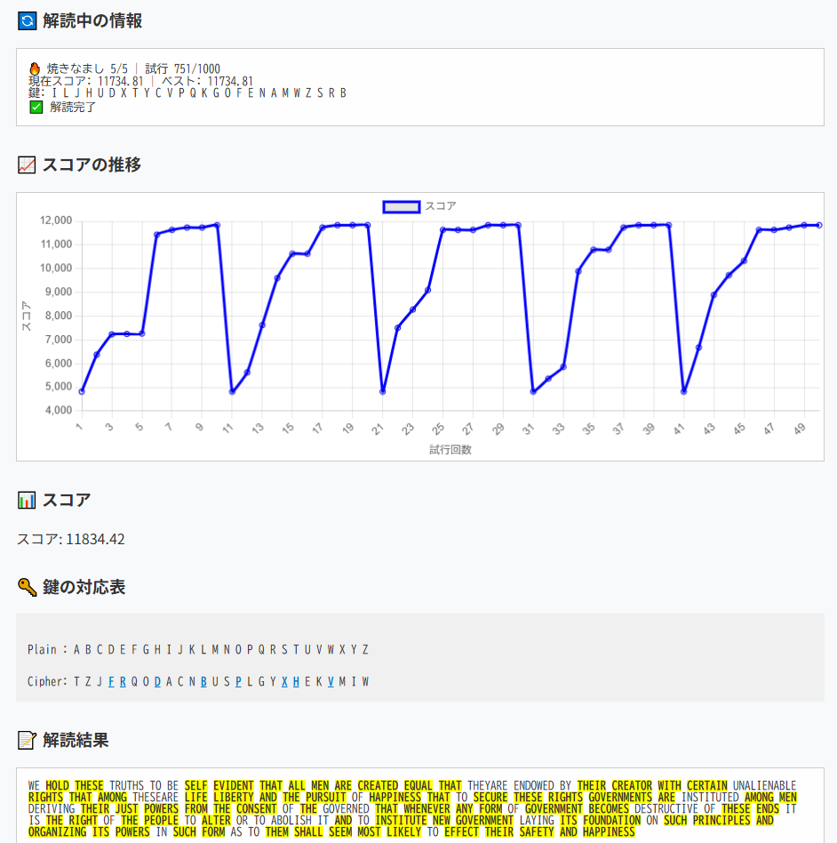

# サイファー・クライム（Cipher Climb） — 古典暗号ヒルクライミング解読ツール

**Day18 - 生成AIで作るセキュリティツール100**

サイファー・クライム（Cipher Climb）は、換字式暗号（代表的な古典暗号の一方式）をヒルクライミング法（hill climbing）で解読するWebアプリです。

"cipher"（暗号）と"climb（登る）"を組み合わせた言葉であり、ヒルクライミング法を用いて暗号を徐々に解きほぐしていくプロセスを表現しています。

このツールは教育用途を想定しており、換字式暗号をスコアベースで自動解読する過程を視覚化・体験できます。

---
## 🌐 デモページ

👉 [https://ipusiron.github.io/cipherclimb/](https://ipusiron.github.io/cipherclimb/)

---
## 📸 スクリーンショット

以下は実際の画面例です。

>
>
> *暗号文の解読過程が可視化された画面例*

---

## 🔧 ツールの仕様

| 項目 | 説明 |
|------|------|
| 対応暗号 | 単一換字式暗号（monoalphabetic substitution cipher） |
| 解読アルゴリズム | ヒルクライミング / 焼きなまし法（Simulated Annealing） |
| 入力形式 | 英大文字A〜Zのみ（スペース・改行は無視されずそのまま保持） |
| 出力 | 鍵の対応表、解読結果、スコア、単語ハイライト表示 |
| 固定鍵指定 | 任意の「平文 → 暗号文」マッピングを固定可能（矛盾時は警告） |
| スコア構成 | 文字頻度・N-gram・辞書照合スコアを加算可能（個別にON/OFF） |
| スコア可視化 | Chart.js による試行ごとのスコア推移グラフ |
| 使用辞書 | Google 10,000語 または NGSL 1000語を選択可能 |

---

## 💡 ユーザーが知っておくとよい技術的ポイント

- 暗号鍵は「26文字のアルファベットの並び替え」によって構成されます（例: `ZEBRAS...`）。
- 固定鍵は「この文字は必ずこの文字に対応する」と明示的に指定できますが、**暗号文側の文字が重複指定されると無効です**（UI上で赤く警告されます）。
- スコア評価は以下の合計で行われます：
  - 英語の文字頻度に近いか（例：'E'、'T'が多く含まれる）
  - 頻出のN-gram（たとえば"TH"、"HE"、"IN"など）に一致するか
  - 辞書内の英単語（部分一致可）が含まれるか

---

## 📘 アルゴリズム解説（初心者向け）

### 🔼 ヒルクライミング法（Hill Climbing）
もっとも単純な探索アルゴリズムの一種。ある解（鍵）を評価し、それより良い解を見つけたら更新していく。

- メリット: シンプル・高速
- デメリット: 局所最適に陥りやすい（山のふもとで満足する）

### 🔥 焼きなまし法（Simulated Annealing）
「温度」を使ってランダム性を持たせたヒルクライミング。

- 悪くなる解でも、確率的に受け入れて探索を続ける
- 時間とともに温度（受容確率）を下げていく
- 「冷却速度」によって探索の粘り強さを調整可能
- このツールでは、温度が下がりすぎたときに「温度リセット」も可能（＝局所最適脱出）

---

## 🎓 本ツールの用途と教育的効果

- 古典暗号（換字式暗号）の構造を視覚的に理解できる
- 焼きなまし・ヒルクライミングの違いと有効性を体験できる
- スコアの構成（文字頻度・単語一致）を調整しながら探索の意味を学べる

---

## 🔗 関連リンク

- [『暗号解読 実践ガイド』](https://akademeia.info/?page_id=39995)
    - 第16章：ヒル・クライミングによる暗号解読 P.367-401

---

## 📄 ライセンス

MIT License - [LICENSE](LICENSE)ファイルを参照

---

## 免責

- 解読を学ぶための教材です。
- 古典暗号用であり、現代暗号には使えません。

---

## 🛠 このツールについて

本ツールは、「生成AIで作るセキュリティツール100」プロジェクトの一環として開発されました。 このプロジェクトでは、AIの支援を活用しながら、セキュリティに関連するさまざまなツールを100日間にわたり制作・公開していく取り組みを行っています。

プロジェクトの詳細や他のツールについては、以下のページをご覧ください。

🔗 [https://akademeia.info/?page_id=42163](https://akademeia.info/?page_id=42163)
