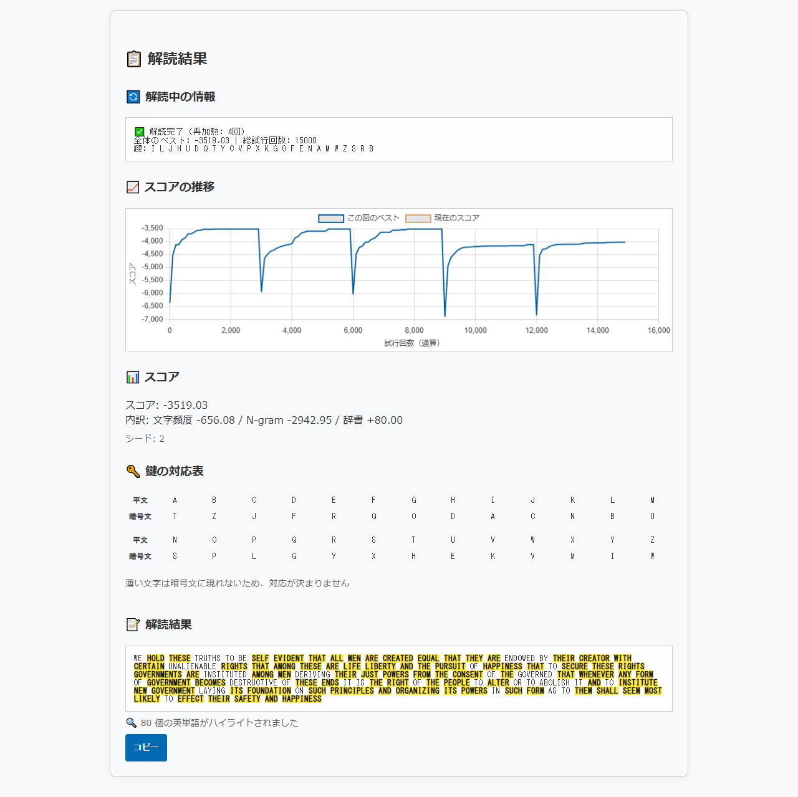
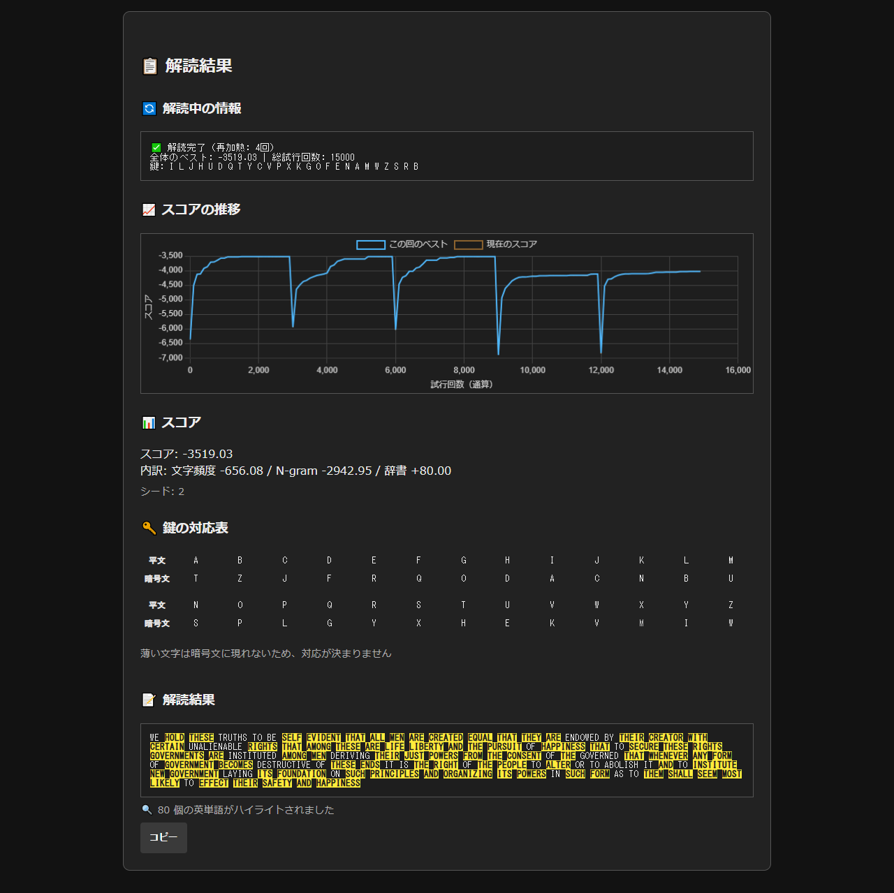
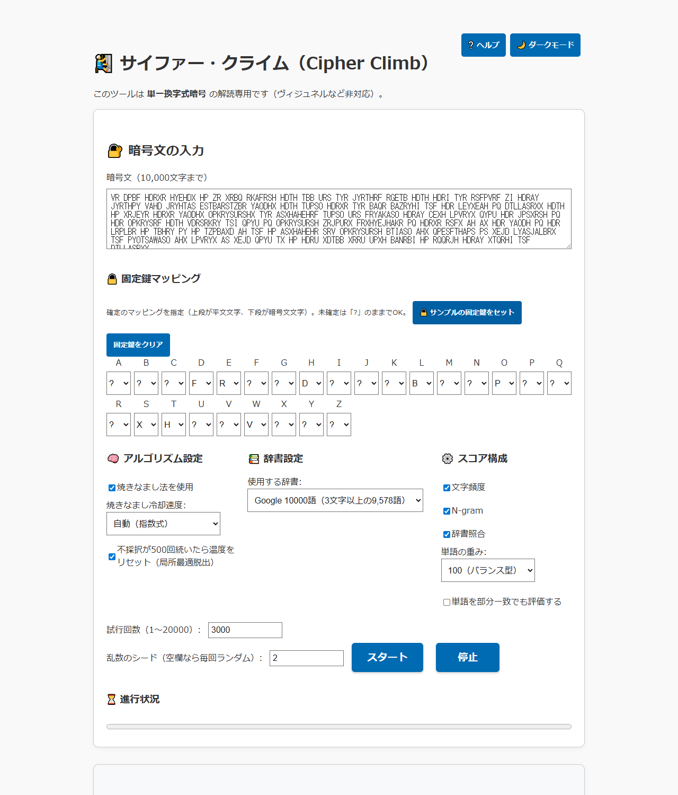

<!--
---
id: day018
slug: cipherclimb

title: "Cipher Climb"

subtitle_ja: "ヒルクライミング解読ツール"
subtitle_en: "Hill Climbing Decryption Tool"

description_ja: "換字式暗号をヒルクライミング法で解読するWebアプリ。暗号解読の過程を視覚化し、焼きなまし法との違いを体験できる教育ツール"
description_en: "A web app that decrypts substitution ciphers using hill climbing algorithm. Educational tool to visualize the decryption process and experience differences with simulated annealing"

category_ja:
  - 古典暗号
  - 暗号解読
  - 換字式暗号
category_en:
  - Classical Cryptography
  - Cryptanalysis
  - Substitution Cipher

difficulty: 4

tags:
  - cipher
  - cryptography
  - hill-climbing
  - substitution-cipher
  - educational
  - security
  - decryption
  - simulated-annealing

repo_url: "https://github.com/ipusiron/cipherclimb"
demo_url: "https://ipusiron.github.io/cipherclimb/"

hub: true
---
-->

# Cipher Climb - 単一換字式暗号のヒルクライミング解読ツール

[](https://github.com/ipusiron/cipherclimb/stargazers)
[](https://github.com/ipusiron/cipherclimb/network/members)
[](https://github.com/ipusiron/cipherclimb/commits/main)
[](LICENSE)
[](https://ipusiron.github.io/cipherclimb/)

**Day018 - 生成AIで作るセキュリティツール100**

Cipher Climb（サイファー・クライム）は、換字式暗号（代表的な古典暗号の一方式）をヒルクライミング法（hill climbing）で解読するWebアプリです。

"cipher"（暗号）と"climb"（登る）を組み合わせた言葉であり、ヒルクライミング法を用いて暗号を徐々に解きほぐしていくプロセスを表現しています。

このツールは教育用途を想定しており、換字式暗号をスコアベースで自動解読する過程を視覚化・体験できます。

---
## 🌐 デモページ

👉 [https://ipusiron.github.io/cipherclimb/](https://ipusiron.github.io/cipherclimb/)

---
## 📸 スクリーンショット

以下は実際の画面例です。


> *シード2・固定鍵なしの解読結果。スコアの内訳、2本の推移線、鍵と80個の単語ハイライト*


> *同じ解読結果のダークテーマ。黄色のハイライトと文字のコントラストを確保*


> *サンプルの固定鍵8個とシード2を設定した入力カード。実行前の状態*

---

## ✨ 機能

- シードによる再現可能な探索と、途中停止時のベスト結果表示
- 文字頻度・N-gram・辞書照合の切り替え、現在とベストのスコアの可視化
- 固定鍵の指定・重複検出、辞書の切り替えと完全一致語のハイライト
- ライト・ダークテーマ、モバイル対応、キーボードで操作できるヘルプ

## 📖 使い方

1. まずは既定の暗号文と設定のまま、シードに`2`を入力して「スタート」を押す
2. スコア、鍵の対応表、解読結果を確認する。黄色の語は選択中の辞書に完全一致した語
3. シードや焼きなまし法のON/OFFを変えて比較する。シードを空欄にすると実行ごとに種を生成
4. 既知の対応があれば固定鍵を指定する。「サンプルの固定鍵をセット」は既定の暗号文専用
5. 「停止」でその時点までのベストを表示し、「コピー」で平文を取り出す

「固定鍵をクリア」で26個すべてを未指定に戻せます。実行中は条件を読み直さず、開始時の条件で最後まで探索します。

## 🔧 ツールの仕様

| 項目 | 説明 |
|------|------|
| 対応暗号 | 単一換字式暗号（monoalphabetic substitution cipher） |
| 解読アルゴリズム | ヒルクライミング法／焼きなまし法（Simulated Annealing） |
| 入力形式 | 英字A〜Z（小文字は大文字として扱う）。空白・改行・記号・数字・非ASCII文字はそのまま残す。10,000文字まで |
| 出力 | 鍵の対応表、解読結果、スコア、単語ハイライト表示 |
| 固定鍵指定 | 任意の「平文 → 暗号文」マッピングを固定可能（矛盾時は警告） |
| スコア構成 | 文字頻度・N-gram・辞書照合スコアを加算可能（個別にON/OFF） |
| スコア可視化 | 100回ごとに、この回のベストと現在のスコアを描画 |
| 使用辞書 | Google 10000語（3文字以上の9,578語）または基本語343語（照合に使うのは3文字以上の320語） |
| 試行回数 | 1〜20000、既定3000（1回の再始動あたり） |
| 再始動 | 5回。別の初期鍵から探索し、全体のベストを採用 |
| 温度 | 初期温度10、終了温度0.01（自動冷却時）。不採択500回で再加熱 |
| シード | 0〜4294967295の整数。空欄は実行ごとに生成 |
| 短い暗号文 | 英字100字未満では警告。正解が一意に決まらない場合がある |

---

### 固定鍵について

- 暗号鍵は26文字のアルファベットの並べ替え
- 固定鍵は「平文→暗号文」の対応。暗号文側の文字を重複指定すると無効となり、赤く表示
- 固定鍵が25個以上なら残りの対応も決まるため、探索せずに結果を表示
- 暗号文に現れない文字の対応は確定できないため、鍵の表では薄い文字で表示

### 動作例

既定のサンプル（639文字、英字529字、111語）を使った結果です。正解率は英字の位置ごとの一致率です。

| 設定 | シード | スコア | 正解率 |
|---|---|---|---|
| 既定 | 1 | -3520.88 | 99.81% |
| 既定 | 2 | -3519.03 | 100.00% |
| ヒルクライミング法（焼きなまし法 OFF） | 1 | -3519.03 | 100.00% |
| 辞書照合 OFF | 1 | -3599.03 | 100.00% |
| 試行回数 200 | 1 | -4268.13 | 42.53% |
| 文字頻度だけ・試行回数 500 | 1 | -653.54 | 33.65% |
| サンプルの固定鍵・試行回数 300 | 1 | -3546.53 | 96.79% |

シード1の既定では`ORGANIZING`が`ORGANIXING`になります。正解の平文ではZが1回、Xが0回のため、スコアの差がわずかで取り違えやすい箇所です。
暗号文で出現しないのはMです。暗号文自体は`samples.js`から起動時に入力欄へ設定します。

### 成功率

シード1〜10の各10回で比較しています。短い暗号文は、平文の先頭32語（末尾`ARE LIFE LIBERTY AND`）を同じ鍵で暗号化したものです。

| 暗号文 | 方法 | 完全解読 | 平均正解率 |
|---|---|---|---|
| 既定の暗号文（英字529字） | 焼きなまし法（既定） | 8/10 | 93.9% |
| 既定の暗号文（英字529字） | ヒルクライミング法 | 10/10 | 100.0% |
| 短い暗号文（英字148字） | 焼きなまし法（既定） | 4/10 | 78.2% |
| 短い暗号文（英字148字） | ヒルクライミング法 | 3/10 | 72.2% |

この長い暗号文ではどちらの方法でも解けています。短い暗号文では焼きなまし法の成功回数がやや多いものの、10回の比較だけで一般的な優劣は断定できません。
試行回数を増やすと改善する可能性がありますが、正解を保証するものではありません。

---

## 📘 アルゴリズム解説（初心者向け）

### 🔼 ヒルクライミング法（Hill Climbing）

最も単純な探索アルゴリズムの一種です。ある解（鍵）を評価し、それより良い解を見つけたら更新していきます。

- メリット: シンプル・高速
- デメリット: 局所最適に陥りやすい（山のふもとで満足する）

### 🔥 焼きなまし法（Simulated Annealing）

「温度」を使ってランダム性を持たせたヒルクライミング法です。

- 悪くなる解でも、確率的に受け入れて探索を続ける
- 時間とともに温度（受容確率）を下げていく
- 「冷却速度」によって探索の粘り強さを調整可能
- このツールでは、不採択が500回続いたときに温度を10へ戻す再加熱も可能

## 🔬 スコアの仕組み

文字頻度とN-gramは対数尤度を使い、辞書照合は加点します。内部では`round(log10(確率) × 100)`の整数を扱い、画面では100で割って表示します。
文字頻度は1文字、N-gramは2文字と3文字の並びの値を加算します。同じ長さなら、値が大きい（0に近い）ほど英語らしいと評価します。
コーパスに現れない並びは画面上の値で-8.71です。

辞書照合は、3文字以上の語が1語一致するごとに「重み÷100」を加えます。既定の重み100では1語につき+1.00です。
部分一致をONにすると、3文字以上の接頭辞でも評価します。ハイライトは設定にかかわらず完全一致だけなので、加点された数と異なる場合があります。

統計はProject Gutenbergの10作品から集計した英字5,141,270字に基づきます。観測したバイグラムは623種、トライグラムは8,604種です。
既定の暗号文の平文（アメリカ独立宣言）は集計に含めていません。

| 作品 | 著者 |
|---|---|
| Alice's Adventures in Wonderland | Lewis Carroll |
| Adventures of Huckleberry Finn | Mark Twain |
| Frankenstein | Mary Wollstonecraft Shelley |
| A Tale of Two Cities | Charles Dickens |
| The Picture of Dorian Gray | Oscar Wilde |
| Dracula | Bram Stoker |
| Pride and Prejudice | Jane Austen |
| Great Expectations | Charles Dickens |
| The Adventures of Sherlock Holmes | Arthur Conan Doyle |
| Moby Dick; Or, The Whale | Herman Melville |

元テキストをそろえた開発者は次のコマンドで再生成できます。Project Gutenbergのテキストは改訂される場合があり、同じ値になるとは限りません。
通常の実行時には生成ツールも元テキストも読み込みません。

```sh
node tools/build-ngram-model.mjs <テキストを置いたフォルダー>
```

### 辞書の出所

9,578語の辞書は[google-10000-english](https://github.com/first20hours/google-10000-english)を3文字以上に絞ったものです。
[上流の利用条件](https://github.com/first20hours/google-10000-english/blob/master/LICENSE.md)では教育・個人・研究目的の利用が認められ、商用利用にはLinguistic Data Consortiumのライセンスが必要です。
本リポジトリーのMITライセンスは、この語彙リストには及びません。

---

## 🎓 本ツールの用途と教育的効果

- 古典暗号（換字式暗号）の構造を視覚的に理解できる
- 焼きなまし・ヒルクライミングの違いと有効性を体験できる
- スコアの構成（文字頻度・単語一致）を調整しながら探索の意味を学べる

---

## 🔗 関連リンク

- [『暗号解読 実践ガイド』](https://akademeia.info/?page_id=39995)
    - 第16章：ヒル・クライミングによる暗号解読 P.367-401

## 🔒 セキュリティとプライバシー

処理はすべてブラウザー内で行い、ツールの実行時に外部への通信は発生しません。Chart.js 4.5.1はMITライセンスの配布物を`vendor/`に同梱しています。
READMEのバッジはGitHub上の表示用であり、ツール本体は外部画像やCDNを読み込みません。
入力をHTMLとして扱わず、DOM APIで表示します。localStorageに保存するのはテーマだけです。
探索は再現可能なシード付き疑似乱数を使います。暗号用の乱数ではありません。

CSPは以下の設定です。`frame-ancestors`はmetaでは効かないため指定していません。埋め込み制限が必要な配信環境ではHTTPヘッダーで設定してください。

```text
default-src 'self'; script-src 'self'; style-src 'self'; img-src 'self' data:; font-src 'self'; connect-src 'none'; object-src 'none'; base-uri 'self'; form-action 'self'
```

## ⚠️ 注意

- 解読を学ぶための教材。古典暗号用であり、現代暗号には使用不可
- 英文を仮定した統計的な推測。スコアの最大値が正しい平文とは限らない
- 短い暗号文や単語区切りのない文章では精度が下がる可能性
- 固定鍵の重複、英字を含まない入力、上限超過はエラーとして実行を停止

## 🧪 テスト

Node 22以上で、依存パッケージをインストールせず実行できます。

```sh
npm test
```

GitHub Actionsでpushとpull_requestのたびに自動実行します。モデルのハッシュ、既知解答A〜P、途中停止、READMEの動作例と成功率の表も再計算して検証します。

## 📁 ディレクトリー構造

```text
cipherclimb/                                     # 単一換字式暗号の解読ツール
├── .github/                                     # GitHubの設定
│   └── workflows/                               # GitHub Actionsのワークフロー
│       └── test.yml                             # pushとpull_requestでnpm testを実行
├── .gitignore                                   # Git管理から除外するファイルの指定
├── .nojekyll                                    # PagesのJekyll処理を無効化
├── assets/                                      # READMEのスクリーンショット
│   ├── screenshot.png                           # 旧版の画面（画像リンクからは参照しない）
│   ├── screenshot2.png                          # ライトテーマの解読結果
│   ├── screenshot3.png                          # 同じ解読結果のダークテーマ
│   └── screenshot4.png                          # サンプルの固定鍵を設定した入力カード
├── chart.js                                     # Chart.jsによるスコア推移の描画
├── CLAUDE.md                                    # AI向けの開発ガイド
├── dictionaries.js                              # 辞書と画面に出す名前
├── englishWords_basic343.js                     # 基本語343語の辞書
├── englishWords_google10000.js                  # 頻出語9,578語の辞書
├── favicon.ico                                  # サイトアイコン
├── index.html                                   # 画面のマークアップ
├── LICENSE                                      # 本ツールのMITライセンス
├── main.js                                      # 画面の組み立てとイベント処理
├── ngramModel.js                                # 英語の文字n-gram統計（自動生成・編集不可）
├── package.json                                 # 依存なしのnpm test定義
├── README.md                                    # 本ドキュメント
├── samples.js                                   # サンプルの平文・鍵・暗号文
├── score.js                                     # 整数によるスコア計算
├── solver.js                                    # 探索とシード付き乱数
├── style.css                                    # CSS変数の配色とレスポンシブレイアウト
├── test/                                        # node --testの自動テスト
│   ├── contrast.test.js                         # 文字色23組・非テキスト5組の検証
│   ├── format.test.js                           # 行長と読みやすさの検証
│   ├── html.test.js                             # CSP・ARIA・入力欄の検証
│   ├── model.test.js                            # モデルと配布物の件数・ハッシュ検証
│   ├── readme.test.js                           # 動作例・成功率・画像・ツリーの検証
│   ├── samples.test.js                          # サンプルと初期値の設定方法の検証
│   ├── score.test.js                            # 整数スコアと辞書照合の検証
│   ├── solver.test.js                           # A〜Pの探索と途中停止の検証
│   ├── static.test.js                           # 純粋性・安全な描画・CI設定の検証
│   ├── support.js                               # 共通のテスト設定と正解率計算
│   └── utils.test.js                            # 文字・入力・固定鍵の検証
├── theme-init.js                                # 描画前のテーマ適用
├── theme.js                                     # テーマの切り替えと保存
├── tools/                                       # 開発時のモデル生成ツール（実行時は読み込まない）
│   └── build-ngram-model.mjs                    # 元テキストから統計を生成
├── utils.js                                     # 前処理・鍵操作・入力検証
└── vendor/                                      # 自己ホストする配布物
    └── chartjs/                                 # Chart.js 4.5.1の配布物
        ├── chart.umd.min.js                     # 改変していない公式配布物
        ├── LICENSE.md                           # Chart.jsのMITライセンス全文
        └── README.md                            # バージョン・入手元・ハッシュの記録
```

## 💻 動作環境

ES module・Canvas・Web Cryptoに対応するモダンブラウザーで動きます。`file://`ではES moduleがCORSで拒否されるため動きません。
ローカルではリポジトリーのフォルダーでHTTPサーバーを起動し、`http://localhost:8000/`を開いてください。

```sh
python -m http.server 8000
```

---

## 📄 ライセンス

本ツールのコードは[MIT License](LICENSE)です。同梱するChart.jsのライセンスは[vendor/chartjs/LICENSE.md](vendor/chartjs/LICENSE.md)を参照してください。
語彙リストには上記「辞書の出所」の利用条件が適用されます。

---

## 🛠️ このツールについて

本ツールは、「生成AIで作るセキュリティツール100」プロジェクトの一環として開発されました。 このプロジェクトでは、AIの支援を活用しながら、セキュリティに関連するさまざまなツールを100日間にわたり制作・公開していく取り組みを行っています。

プロジェクトの詳細や他のツールについては、以下のページをご覧ください。

🔗 [https://akademeia.info/?page_id=42163](https://akademeia.info/?page_id=42163)
